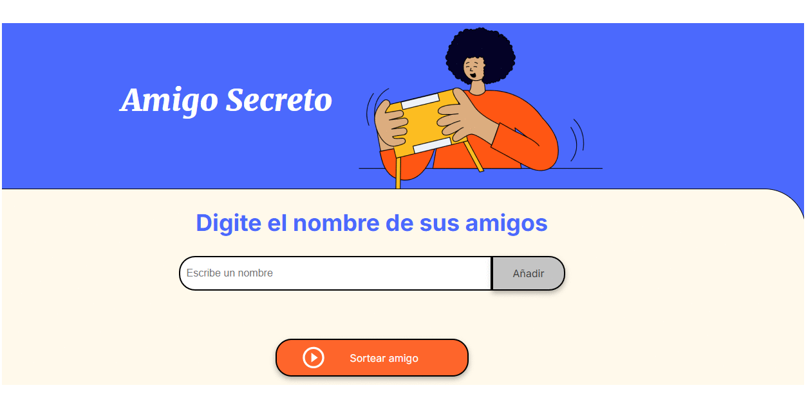

# Amigo Secreto

## Tabla de Contenidos

- [Descripción del Proyecto](#descripcion-del-proyecto)
- [Estado del Proyecto](#estado-del-proyecto)
- [Demostración de funciones y aplicaciones](#demostracion-de-funciones-y-aplicaciones)
- [Acceso al Proyecto](#acceso-al-proyecto)
- [Tecnologías utilizadas](#tecnologias-utilizadas)
- [Personas Contribuyentes](#personas-contribuyentes)
- [Personas Desarrolladoras del Proyecto](#personas-desarrolladoras-del-proyecto)
- [Licencia](#licencia)

## Descripción del Proyecto

Este proyecto es una aplicación web sencilla para realizar el sorteo de "Amigo Secreto". Permite a los usuarios ingresar los nombres de sus amigos, luego realiza el sorteo de manera aleatoria y muestra quién le regala a quién.

## Estado del Proyecto

El proyecto está culminado.

## Demostración de funciones y aplicaciones

## Acceso al Proyecto

Puedes acceder al proyecto yendo a este enlace:

[Enlace](https://andreyali.github.io/Amigo-Secreto/)

## Tecnologías utilizadas

- HTML
- CSS
- JavaScript

